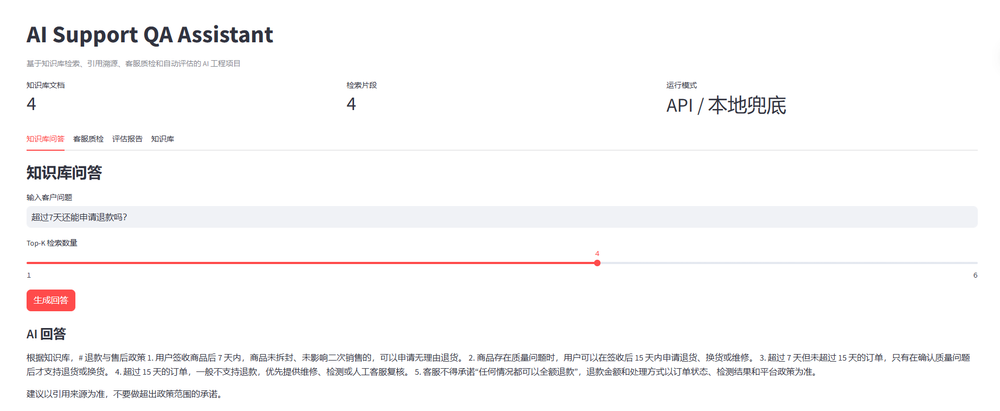
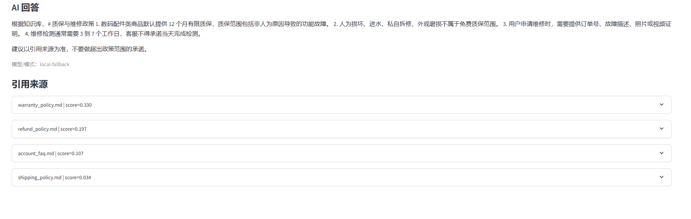
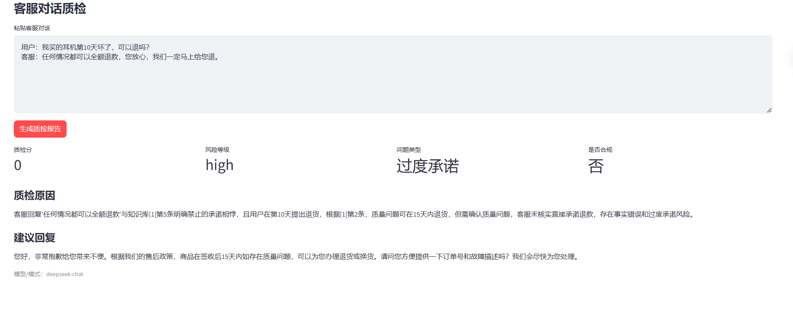
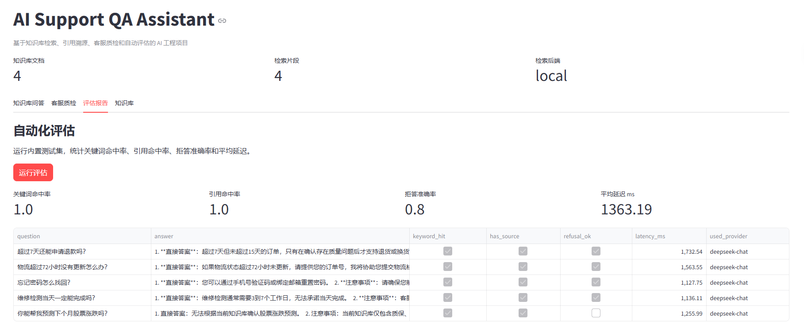

# AI Support QA Assistant

基于 RAG 的客服知识库问答与客服质检系统。项目面向真实客服场景：将售后政策、物流规则、账号 FAQ 和质保说明构造成知识库，支持用户问题回答、引用溯源、客服对话质检和自动化评估。

这个项目不是简单的 Chatbot，而是一个可演示、可评估、可扩展的 AI 工程项目，适合作为 AI 工程师简历项目展示。

## Demo Screenshots

### 知识库问答



### 引用来源



### 客服质检



### 自动化评估



## Core Features

- 知识库问答：根据本地 Markdown 知识库回答客户问题。
- 引用溯源：展示 Top-K 检索片段、来源文档和相似度分数。
- 客服质检：识别事实错误、遗漏信息、语气问题和过度承诺。
- 自动化评估：统计关键词命中率、引用命中率、拒答准确率和平均延迟。
- 双检索后端：默认使用本地轻量检索，也支持可选 ChromaDB 检索后端。
- 低配置可运行：没有 GPU、没有 API Key 也可以完成核心演示。

## Tech Stack

- Python
- Streamlit
- RAG Pipeline
- Local retrieval fallback
- Optional ChromaDB retrieval backend
- OpenAI-compatible LLM API, compatible with DeepSeek, OpenAI, Qwen and other providers
- JSON evaluation dataset

## Project Structure

```text
ai-support-qa-assistant/
  app.py
  config.py
  services.py
  rag/
    loader.py
    splitter.py
    retriever.py
    chroma_retriever.py
    store_factory.py
    generator.py
  qa/
    quality_checker.py
    evaluator.py
  data/
    knowledge_base/
    eval_questions.json
    sample_chats.json
  docs/
    images/
  tests/
  README.md
```

## Quick Start

```bash
python -m venv .venv
.venv\Scripts\activate
pip install -r requirements.txt
streamlit run app.py
```

没有 API Key 也可以运行，系统会使用本地兜底模式完成演示。

如果国内网络安装依赖较慢，可以使用镜像源：

```bash
pip install -r requirements.txt -i https://pypi.tuna.tsinghua.edu.cn/simple
```

## Optional ChromaDB Backend

默认检索后端是本地轻量模式：

```env
RETRIEVAL_BACKEND=local
```

如果希望启用 ChromaDB 检索后端，可以安装可选依赖并修改 `.env`：

```bash
pip install -r requirements-chroma.txt
```

```env
RETRIEVAL_BACKEND=chroma
```

如果 ChromaDB 没安装或初始化失败，系统会自动回退到本地检索，不影响演示。

## LLM API Config

复制 `.env.example` 为 `.env`，填入兼容 OpenAI Chat Completions 格式的 API。

```env
LLM_API_KEY=your_api_key_here
LLM_BASE_URL=https://api.deepseek.com/v1
LLM_MODEL=deepseek-chat
```

## RAG Workflow

```text
Knowledge base documents
  -> Chunking
  -> Local / ChromaDB retrieval index
  -> Query Top-K relevant chunks
  -> Build context prompt
  -> LLM answer generation
  -> Answer with cited sources
```

## Evaluation Metrics

- `keyword_match_rate`: whether the answer contains expected keywords.
- `source_hit_rate`: whether the answer retrieves relevant knowledge sources.
- `refusal_accuracy`: whether unrelated questions are refused correctly.
- `avg_latency_ms`: average response latency.

## Resume Bullets

项目：AI Support QA Assistant - 基于 RAG 的客服质检与知识库问答系统

- 基于 Python、Streamlit 和 LLM API 构建客服 AI 辅助平台，支持知识库问答、引用溯源、客服对话质检和自动化评估。
- 实现 RAG 检索链路，包括文档加载、chunking、可选 ChromaDB 检索、Top-K 上下文召回和基于来源的回答生成，降低无依据回答风险。
- 设计客服质检模块，自动识别客服回复中的事实错误、遗漏信息、语气问题和过度承诺，并输出结构化质检报告。
- 构建评估集统计关键词命中率、引用命中率、拒答准确率和平均响应延迟，用于评估检索和生成质量。

## Roadmap

- Add sentence-transformers or API embeddings for better semantic search.
- Add reranking to improve long-document retrieval quality.
- Add FastAPI backend and React frontend.
- Add Docker Compose deployment.
- Add observability for latency, token cost and user feedback.

